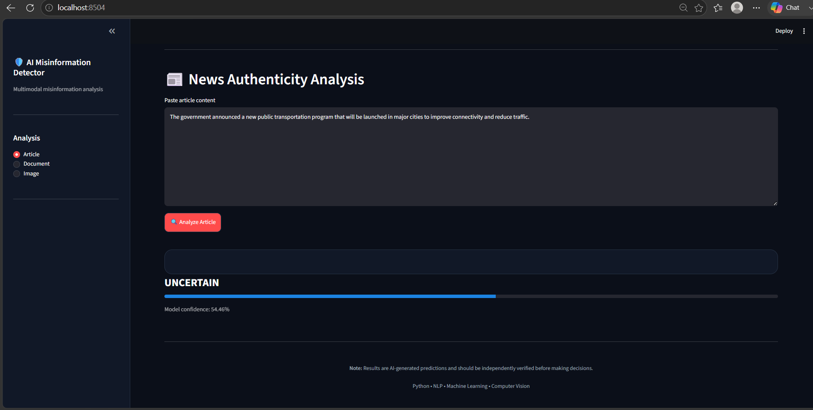
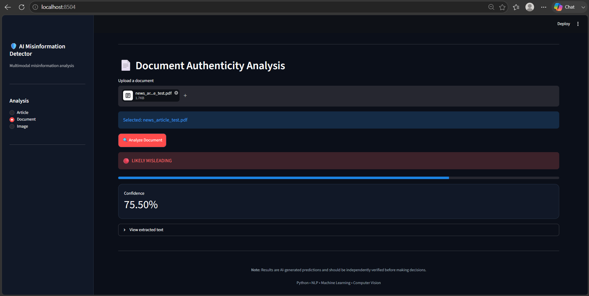
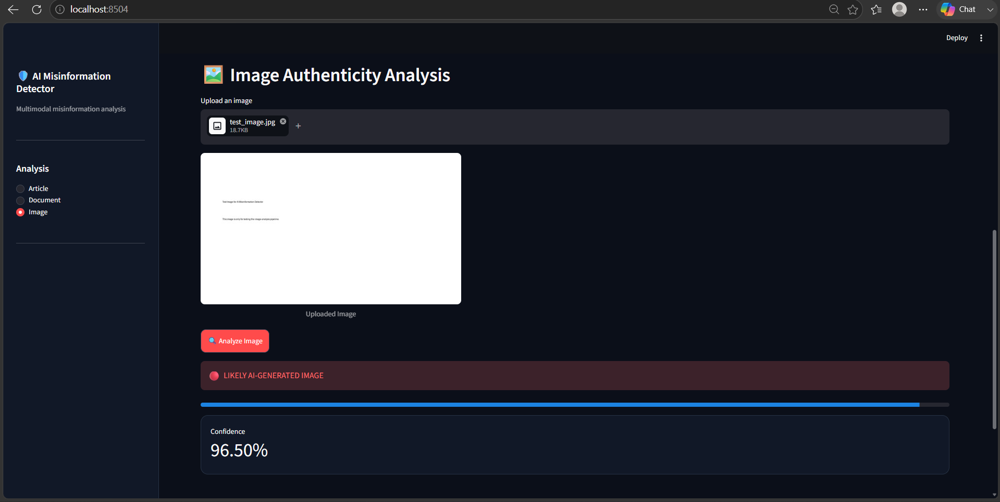
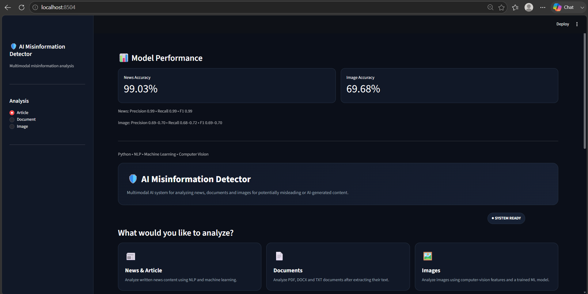

# AI Misinformation Detector

A multimodal machine-learning application that analyzes news articles, documents, and images to identify potentially misleading or AI-generated content.

## Features

- 📰 News and article analysis
- 📄 PDF, DOCX, and TXT document analysis
- 🖼️ AI-generated image detection
- 📊 Confidence scores
- 🟡 Uncertain prediction handling
- 📈 Analysis history
- 🖥️ Interactive Streamlit interface

## Technologies

- Python
- Streamlit
- Scikit-learn
- Natural Language Processing (NLP)
- Machine Learning
- Computer Vision
- OpenCV
- HOG (Histogram of Oriented Gradients)
- PyPDF
- python-docx

## System Workflow

```text
Input
  ↓
Preprocessing
  ↓
Feature Extraction
  ↓
Machine Learning Model
  ↓
Prediction
  ↓
Confidence Score

```


## 📸 Application Screenshots

### 📰 News Article Analysis


### 📄 Document Analysis


### 🖼️ AI-Generated Image Detection


### 📊 Model Performance


## 📊 Model Performance

| Model | Accuracy |
|---|---:|
| News Classification | 99.03% |
| Image Classification | 69.68% |

> Note: Model performance depends on the dataset and evaluation conditions. Predictions should be independently verified before making important decisions.

## ▶️ How to Run

### 1. Clone the repository

```bash
git clone https://github.com/Udayshivhare/AI-Misinformation-Detector.git
cd AI-Misinformation-Detector

## 🔮 Future Improvements

- Improve image detection accuracy with a larger and more diverse dataset
- Add OCR-based analysis for images containing text
- Add explainable AI to provide reasons behind predictions
- Integrate external fact-checking sources
- Deploy the application as a cloud-based service